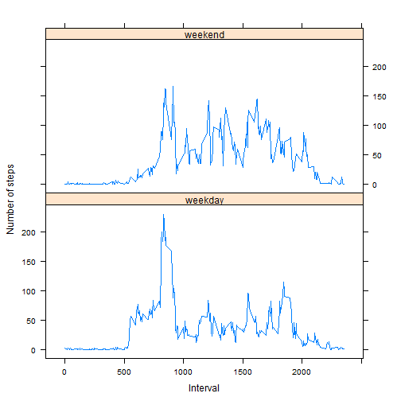

#### Reproducible Research: Peer Assignment 1
#### by Steve Myles
#### May 2015


## Loading and preprocessing the data

#### Show any code that is needed to

#### 1. Load the data (i.e. `read.csv()`)


I am assuming that either the data file (or the zipped version of it) is in 
the working directory.  First, the code below checks whether the data file
("activity.csv") exists.  If not, it unzips the zipped version of the file.  
It then loads the data into a data frame called "data."


```r
if (!file.exists("activity.csv")) {
     unzip("activity.zip")     
     }

## read the data to a data frame
data <- read.csv("activity.csv")
```


#### 2. Process/transform the data (if necessary) into a format suitable for your analysis


The only preprocessing step undertaken is conversion of the data frame's "date"
field (which is stored as a factor) to a date.


```r
data$date <- as.Date(as.character(data$date), format="%Y-%m-%d")
```


## What is mean total number of steps taken per day?

#### For this part of the assignment, you can ignore the missing values in the dataset.

#### 1. Make a histogram of the total number of steps taken each day


I have chosen to facilitate some of the calculations in this assignmnet by 
using the  [dplyr](http://cran.rstudio.com/web/packages/dplyr/) package. This
is loaded (or installed, if necessary) using the pkgInst function that follows.


```r
## "pkgInst" is a function that checks whether a set of packages are installed
## and, if not, installs them.  x is a set of packages.
pkgInst <- function(x) {
    for (i in x) {
        ## "require" returns TRUE invisibly if it was able to load package
        if (!require(i, character.only = TRUE)) {
            ## if package was not able to be loaded, install it
            install.packages(i, dependencies = TRUE)
            ## load package after installing
            require (i, character.only = TRUE)
        }
    }
}

## run pkgInst for the dplyr package
pkgInst("dplyr")
```


This allows for the following simple calculation and the creation of the
histogram.


```r
## calculate the total steps per day ignoring missing values
totalSteps <- summarize(group_by(data[complete.cases(data),], date),
                        steps = sum(steps))

## make a histogram of the total number of steps taken each day
hist(totalSteps$steps, main = "Histogram of Total Steps per Day", 
     ylab = "Number of Days", xlab = "Total Steps", col = 4, breaks = 20)
```

 


#### 2. Calculate and report the **mean** and **median** total number of steps taken per day


```r
## calculate the mean and median total number of steps taken per day
meanSteps <- mean(totalSteps$steps)
medianSteps <- median(totalSteps$steps)
```


The mean total number of steps taken per day is **10766.19** and the median is **10765**.  The preceding sentence
used R Markdown to return the values of "meanSteps" and "medianSteps" as
calculated above.


## What is the average daily activity pattern?

#### 1. Make a time series plot (i.e. `type = "l"`) of the 5-minute interval (x-axis) and the average number of steps taken, averaged across all days (y-axis)


```r
## calculate the average steps per interval across all days using dplyr's 
## "summarize function"
avgStepsperInt <- summarize(group_by(data, interval), 
                            steps = mean(steps, na.rm=TRUE))

## create a time series plot of the 5-minute intervals vs. the average number
## of steps taken
plot(x = avgStepsperInt$interval, y = avgStepsperInt$steps, type = "l",
     main = "Average Steps per Interval", ylab = "Avg. Steps", 
     xlab = "Interval", col = 4)
```

 


#### 2. Which 5-minute interval, on average across all the days in the dataset, contains the maximum number of steps?


```r
peakInt <- avgStepsperInt[avgStepsperInt$steps == max(avgStepsperInt$steps), ]
```


The 5-minute interval containing the maximum number of steps is interval
**835**.


## Imputing missing values

#### Note that there are a number of days/intervals where there are missing  values (coded as `NA`). The presence of missing days may introduce bias into some calculations or summaries of the data.**

#### 1. Calculate and report the total number of missing values in the dataset (i.e. the total number of rows with `NA`s)


```r
NArecords <- data[!complete.cases(data), ]
missingVal <- nrow(NArecords)
```


There are **2304** missing values in the dataset (this sentence
returns the value of "missingVal" as calculated above).


#### 2. Devise a strategy for filling in all of the missing values in the dataset. The strategy does not need to be sophisticated. For example, you could use the mean/median for that day, or the mean for that 5-minute interval, etc.


I have chosen to replace the missing values with the mean for that interval 
across all days as calculated above (avgStepsperInt).


#### 3. Create a new dataset that is equal to the original dataset but with the missing data filled in.


```r
## using dplyr's "left_join" function, merge the two datasets (joining on
## interval)
dataNew <- left_join(data, avgStepsperInt, by = "interval")

## if the value of steps.x (the steps variable from the original dataset) is 
## NA, set it equal to the value of steps.y  (the avg. steps per interval) 
dataNew <- within(dataNew, steps.x <- ifelse(!is.na(steps.x), steps.x, 
                                             steps.y))

## set the values of steps.y to NULL to remove that column from the data frame
dataNew$steps.y <- NULL

## convert steps.x to integer in order to mimic the steps column in the
## original dataset
dataNew$steps.x <- as.integer(dataNew$steps.x)

## rename the columns (basically, change "steps.x" to "steps")
names(dataNew) <- c("steps", "date", "interval")
```


#### 4. Make a histogram of the total number of steps taken each day and Calculate and report the **mean** and **median** total number of steps taken per day. Do these values differ from the estimates from the first part of the assignment? What is the impact of imputing missing data on the estimates of the total daily number of steps?


```r
## calculate the total steps per day
totalStepsNew <- summarize(group_by(dataNew, date), steps = sum(steps))

## make a histogram of the total number of steps taken each day
hist(totalStepsNew$steps, main = "Histogram of Total Steps per Day with Imputed
     Data", ylab = "Number of Days", xlab = "Total Steps", col=4, 
     breaks = 20)
```

 

```r
## calculate the mean and median total number of steps taken per day
meanStepsNew <- mean(totalStepsNew$steps)
medianStepsNew <- median(totalStepsNew$steps)
```


The mean total number of steps taken per day is **10749.77** and the median is **10641**.  (The preceding
sentence uses R Markdown to return the values of "meanStepsNew" and 
"medianStepsNew" as calculated above.)

The impact of the imputed values is a leftward-shift in the distribution of 
total steps taken per day, indicated by the fact that both the mean and median
are lower in the case of the dataset with imputed data.


## Are there differences in activity patterns between weekdays and weekends?

#### 1. Create a new factor variable in the dataset with two levels -- "weekday" and "weekend" indicating whether a given date is a weekday or weekend day.


```r
## add a column called "wdaywend" to dataNew indicating whether each date is a
## weekend (Saturday or Sunday) or a weekday (any other date)
dataNew <- within(dataNew, wdaywend <- ifelse((weekdays(date) == "Saturday" | 
                                                    weekdays(date) == "Sunday"),
                                              "weekend", "weekday"))

## convert the wdaywend column to factor
dataNew$wdaywend <- as.factor(dataNew$wdaywend)
```


#### 2. Make a panel plot containing a time series plot (i.e. `type = "l"`) of the 5-minute interval (x-axis) and the average number of steps taken, averaged  across all weekday days or weekend days (y-axis).


```r
## calculate the average steps per interval across all weekend days or weekday
## days
avgStepsperIntNew <- summarize(group_by(dataNew, interval, wdaywend), 
                            steps = mean(steps))

## run the pkgInst (see above) to load (and install, if necessary) the lattice
## package
pkgInst("lattice")

## create the time series plot with the interval on the x-axis, the number of 
## steps on the y-axis, and the two panels being set to the values of wdaywend
## (Weekend and weekday). set the labels.
xyplot(steps ~ interval | wdaywend, data = avgStepsperIntNew, layout = c(1,2),
       type="l", xlab = "Interval", ylab = "Number of steps")
```

 
